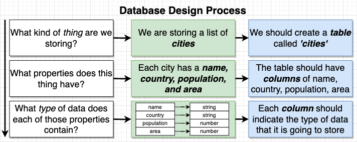

# What is PostgreSQL Database?

- SQL is used to interact with databases. SQL is supported by Oracle, MS SQL Server, MySQL and PostgreSQL.
- Challenges of Postgres
  - Writing efficient queries to retrieve information.
  - Designing the schema, or structure of the database.
  - Understanding when to use advanced features.
  - Managing the database in a production environment. (e.g., running backups, scaling up database)

## Database Design Process



## Dummy PostgreSQL Database

- [pg-sql](https://pg-sql.com/)

## Queries

#### Creating Tables

```sql
CREATE TABLE cities (
    name VARCHAR(50),
    country VARCHAR(50),
    population INTEGER,
    area INTEGER
);
```

#### Inserting Data

```sql
INSERT INTO cities (name, country, population, area)
VALUES ('Tokyo', 'Japan', 38505000, 8223);

INSERT INTO cities (name, country, population, area)
VALUES
    ('Delhi', 'India', 28125000, 2240),
    ('Shanghai', 'China', 22125000, 4015),
    ('Sao Paulo', 'Brazil', 20935000, 3043);
```

#### Retrieving Data

```sql
SELECT * FROM cities;
SELECT name, population FROM cities;
```

#### Processing Data

| Math Operators |  Description   |
| :------------: | :------------: |
|      `+`       |      Add       |
|      `-`       |    Subtract    |
|      `*`       |    Multiply    |
|      `/`       |     Divide     |
|      `^`       |    Exponent    |
|     `\|/`      |  Square Root   |
|      `@`       | Absolute Value |
|      `%`       |   Remainder    |

```sql
SELECT name, (population/area) AS density FROM cities;
```

#### String Operators and Functions

| Functions  | Description                            |
| :--------: | -------------------------------------- |
|   `\|\|`   | Join 2 strings                         |
| `CONCAT()` | Join 2 strings                         |
| `LOWER()`  | Gives a lowercase string               |
| `LENGTH()` | Gives number of characters in a string |
| `UPPER()`  | Gives an uppercase string              |

```sql
SELECT name || ', ' || country AS location FROM cities;
SELECT CONCAT(name, ', ', country) AS location FROM cities;
SELECT UPPER(CONCAT(name, ', ', country)) AS location FROM cities;
```
