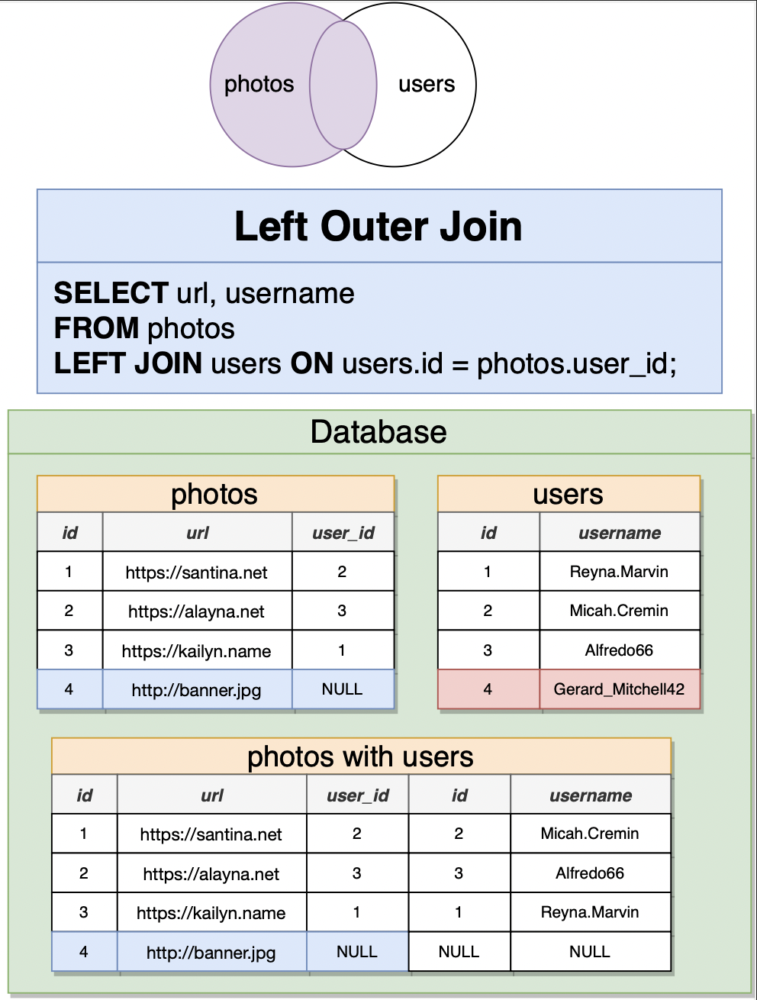
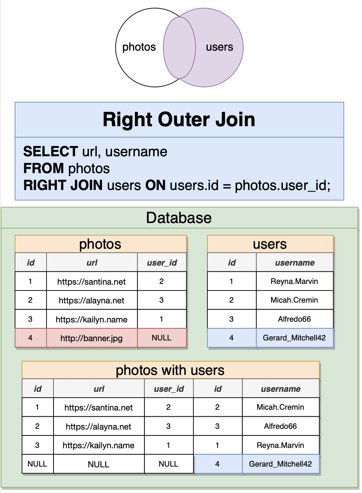
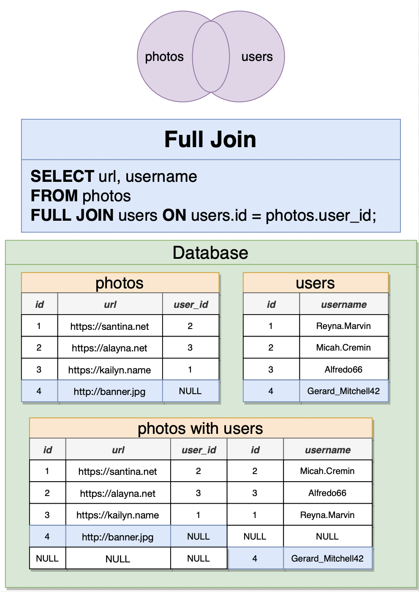
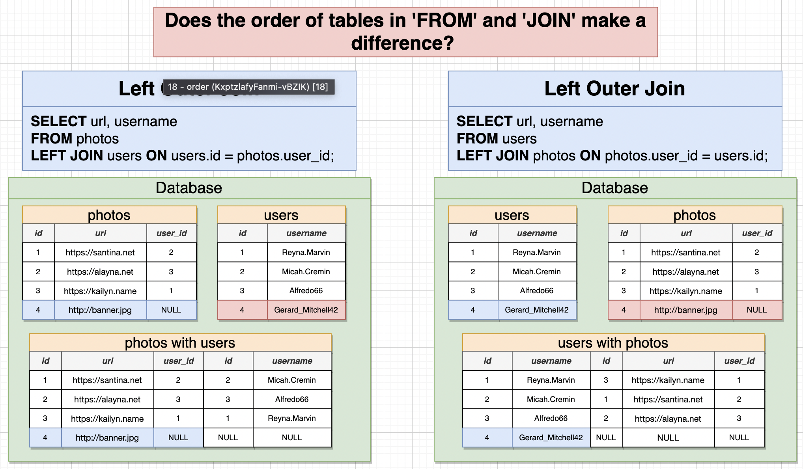

# Relating Records with Joins

## Join with Different Tables


```sql
SELECT contents, username
FROM COMMENTS
JOIN users ON users.id = comments.user_id;

-- Shorter Syntax
SELECT comments.id AS comment_id, p.id
FROM photos AS p
JOIN COMMENTS ON comments.photo_id = p.id;
```

## 4 types of Joins

- `INNER JOIN` or `JOIN`, removes rows that don't match in both tables
- `LEFT JOIN`
- `RIGHT JOIN`
- `FULL JOIN`






## Order of Join Matters!



## JOIN with `WHERE`

```sql
SELECT url, contents, username
FROM comments
JOIN photos ON photos.id = comments.photo_id
WHERE comments.user_id = photos.user_id;
```

## 3-way JOIN

- Rows with NULL are excluded because we use `INNER JOIN`
- The goal of this join is to find out the username who created the photo and also commented on the photo.

```sql
SELECT url, contents, username
FROM comments
JOIN photos ON photos.id = comments.photo_id
JOIN users ON users.id = comments.user_id AND users.id = photos.user_id;
```
