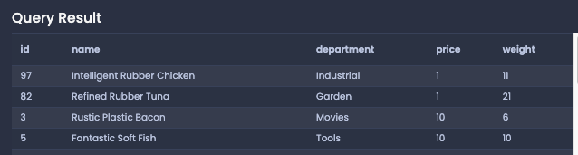

# Sorting

## Sorting by number

```sql
SELECT *
FROM products
ORDER BY price; -- default to ASC (ascending)

SELECT *
FROM products
ORDER BY price DESC; -- descending
```

## Sorting by string

```sql
SELECT *
FROM products
ORDER BY name;

SELECT *
FROM products
ORDER BY name DESC;
```

## Two Variations on Sorting

- From the example below, if 2 products have the same `price`, then we will order by `weight`.

```sql
SELECT *
FROM products
ORDER BY price, weight;
```



## `OFFSET` and `LIMIT`

- `OFFSET 3`: Skips the first 3 rows of the result set.
- `LIMIT 2`: Only give the first 2 rows of the result set.

```sql
-- Write a query that shows the names of only
-- the second and third most expensive phones
SELECT name
FROM phones
ORDER BY price desc
LIMIT 2 OFFSET 1;
```

---

#### Use Cases

1. To find the top most records, or bottom least records. Used with `ORDER BY`.

```sql
-- Top 5 cheapest products
SELECT * FROM products
ORDER BY price
LIMIT 5;

-- Top 5 expensive products
SELECT * FROM products
ORDER BY price DESC
LIMIT 5;
```

2. Pagination

```sql
-- Page 1 with 20 records
SELECT * FROM products
ORDER BY id
LIMIT 20 OFFSET 0;

-- Page 2 with 20 records
SELECT * FROM products
ORDER BY id
LIMIT 20 OFFSET 20;
```

---
