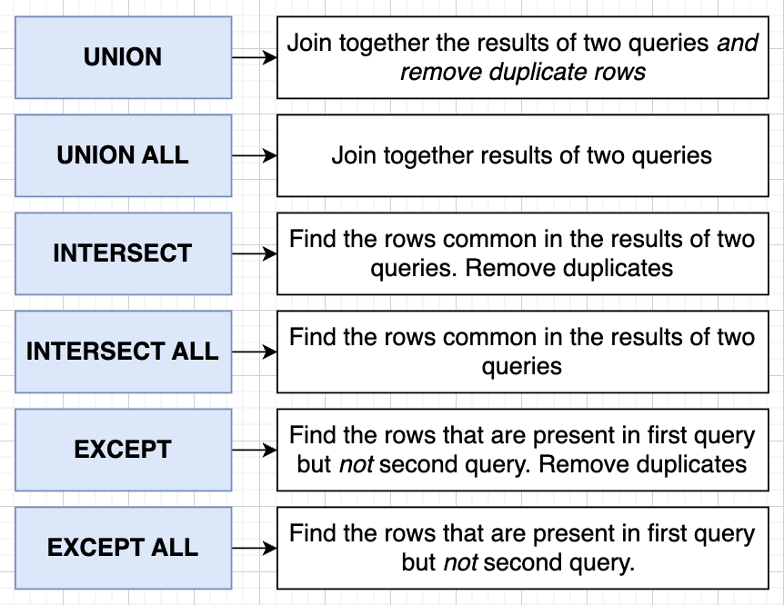
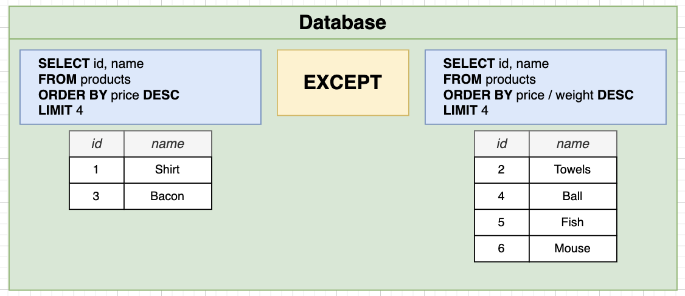
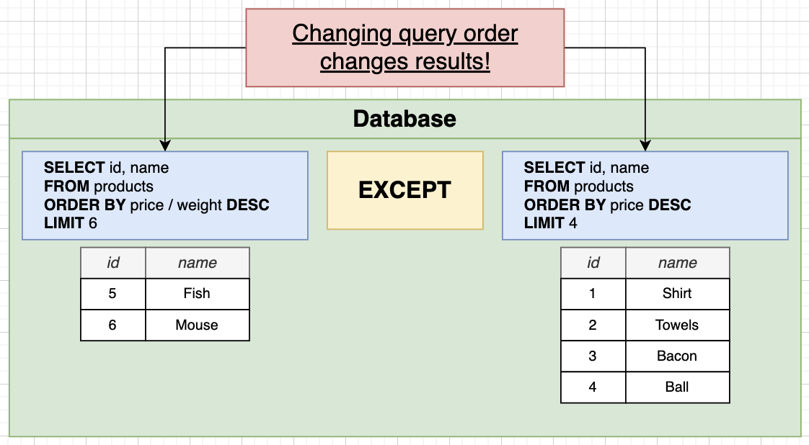

# Unions and Intersections with Sets

- In `UNION`, the number of columns and order of columns of all queries must be same.



## Handling Sets with Union

- Example: Find the 4 products with the highest price AND the 4 products with the highest price/weight ratio.

---

#### `UNION`: combine the results of 2 or more `SELECT` queries into a single result set, **eliminating duplicates**.

```sql
(
  SELECT * FROM products
	ORDER BY price DESC
	LIMIT 4
)
UNION
(
	SELECT * FROM products
	ORDER BY price / weight DESC
	LIMIT 4
);
```

#### `UNION ALL`: combines the results of 2 or more `SELECT` queries, **including duplicate rows** from each query.

---

## Notes on Union

- Error Message: UNION types character varying and integer cannot be matched.

```sql
SELECT name FROM products
UNION
SELECT price FROM products;
```

## `INTERSECT`: Find the rows common in the result of 2 queries. Removes duplicates.

```sql
(
  SELECT * FROM products
	ORDER BY price DESC
	LIMIT 4
)
INTERSECT
(
	SELECT * FROM products
	ORDER BY price / weight DESC
	LIMIT 4
);
```

## `EXCEPT`: Find the rows that are present in first query, but not second query. Removes duplicates.




### Assignment

```sql
-- Write a query that will print the manufacturer of phones where the phone's price is less than 170.  Also print all manufacturer that have created more than two phones.
(
    SELECT manufacturer FROM phones
    WHERE price < 170
)
UNION
(
    SELECT manufacturer FROM phones
    GROUP BY manufacturer
    HAVING COUNT(*) > 2
);
```
