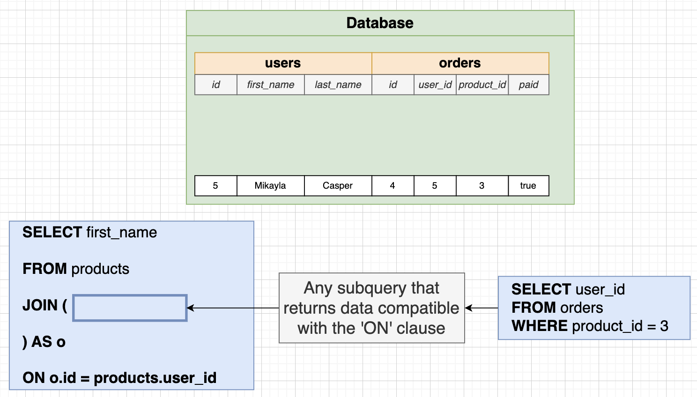
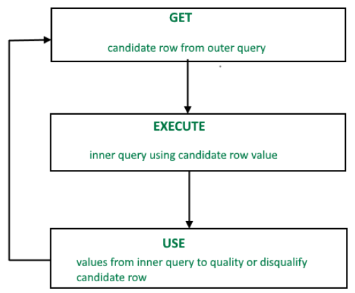

# Assembling Queries with SubQueries

## What's a SubQuery?

- A SubQuery in SQL is a nested query within another query that is used to retrieve data based on the results of the inner query.

```sql
-- List the name and price of all products that are
-- more expensive than all products in the Toys department
SELECT name, price
FROM products
WHERE price > (
    SELECT MAX(price) -- SubQuery
    FROM products
    WHERE department = 'Toys'
);
```


## SubQueries in a `SELECT`

- Can put the SubQuery in a SELECT because it returns a _single_ value.

```sql
-- Any SubQuery that results in a single value
SELECT name, price, (SELECT MAX(price) FROM products)
FROM products
WHERE price > 876
```

```sql
-- Write a query that prints the name and price for each phone.  In addition, print out the ratio of the phones price against max price of all phones (so price / max price).  Rename this third column to price_ratio
SELECT name, price,
(price / (SELECT MAX(price) FROM phones)) AS price_ratio
FROM phones;
```

## SubQueries in a `FROM`

- Any SubQuery so long as the outer SELECT/WHERE/etc are compatible
- The SubQuery must have an alias applied to it.

```sql
-- Meaningless Example (for learning)
SELECT name, price_weight_ratio
FROM (
    SELECT name, price / weight AS price_weight_ratio
    FROM products
) AS p -- must include this alias 'p' for the FROM SubQuery
WHERE price_weight_ratio > 5

-- Meaningful example (Find the average number of orders for all users)
SELECT AVG(order_count)
FROM (
    SELECT user_id, COUNT(*) AS order_count
	FROM orders
	GROUP BY user_id
) AS p;
```

```sql
-- Assignment
-- Calculate the average price of phones for each manufacturer.  Then print the highest average price. Rename this value to max_average_price
-- Column in `phones` table: name, manufacturer, price, units_sold
SELECT MAX(avg_price) AS max_average_price
FROM (
    SELECT AVG(price) as avg_price
    FROM phones
    GROUP BY manufacturer
);
```

## SubQueries in `JOIN` clause



- Any SubQuery that returns data compatible with the `ON` clause.

```sql
-- Not the best example but this is just to understand how it works
SELECT first_name
FROM users
JOIN (
 	SELECT user_id FROM orders WHERE product_id = 3
) AS o
ON o.user_id = users.id;
```

## SubQueries in `WHERE` clause

- These SubQueries are embedded within the main query to filter and retrieve data based on specific conditions or criteria.

```sql
-- Show the id of orders that involve a product with
-- a price/weight ratio greater than 50
SELECT id
FROM orders
WHERE product_id IN (
    SELECT id FROM products
    WHERE price/weight > 50
);
```

```sql
-- Show the name of all products with a price greater
-- then the average product price
SELECT name
FROM products
WHERE price > (
    SELECT AVG(price)
    FROM products
);
```

## `NOT IN` Operator with a list

```sql
-- Show the name of all products that are not in the same
-- department as products with a price less than 100
SELECT name, department
FROM products
WHERE department NOT IN (
    SELECT department
    FROM products
    WHERE price < 100
);
```

## `ALL` operator in `WHERE` clause

- The `ALL` operator in the `WHERE` clause is used to compare a value with all values in a subquery and returns true if the comparison is true for **all** values in the subquery.
- `> ALL`, `< ALL`, `>= ALL`, `<= ALL`, `= ALL`, `<> ALL`

```sql
-- Show the name, department, and price of products that are
-- more expensive than all products in the 'Industrial' department
SELECT name, department, price
FROM products
WHERE price > ALL (
 	SELECT price FROM products WHERE department = 'Industrial'
);

-- Another way
SELECT name, department, price
FROM products
WHERE price > (
 	SELECT MAX(price) FROM products WHERE department = 'Industrial'
);
```

## `SOME` operator in `WHERE` clause

- The `SOME` operator in the `WHERE` clause is used to compare a value with the result of a subquery, and it returns true if the value matches **any** of the values returned by the subquery.
- Can also use `ANY`, same as `SOME`.
- `> SOME`, `< SOME`, `>= SOME`, `<= SOME`, `= SOME`, `<> SOME`

```sql
-- Show the name of products that are more expensive than at
-- least one product in the 'Industrial' department
SELECT name, department, price
FROM products
WHERE price > SOME ( -- can also use `ANY`
    SELECT price
    FROM products
    WHERE department = 'Industrial'
);
```

## Correlated SubQueries



- Correlated SubQueries reference columns from the outer query and are executed for each row of the outer query, allowing for more complex and context-dependent data retrieval.
- It is like a form of _double nested loop_.

```sql
-- Show the name, department and price of the
-- most expensive product in each department
SELECT name, department, price
FROM products AS p1
WHERE p1.price = (
    SELECT MAX(price)
    FROM products AS p2
    WHERE p2.department = p1.department
);
```

```sql
-- Without using a join or a group by, print
-- the number of orders for each product
-- Use `orders` and `products` table
-- Using Correlated SubQuery in `SELECT`
SELECT name, (
    SELECT COUNT(*)
    FROM orders AS o1
    WHERE o1.product_id = p1.id
)
FROM products AS p1;
```

## `SELECT` without a `FROM` that includes a subquery

- Only works if subquery returns 1 single value
- Retrieves data directly from the subquery result rather than a specific table.

```sql
SELECT (
    SELECT MAX(price)
    FROM products
);

SELECT (
    SELECT MAX(price)
    FROM products
) / (
    SELECT MIN(price)
    FROM products
);

-- with alias
SELECT (
    SELECT MAX(price)
    FROM products
) AS max_price, (
    SELECT MIN(price)
    FROM products
) AS min_price;
```
