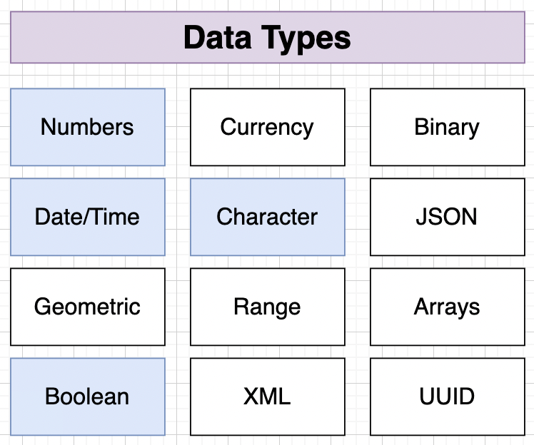
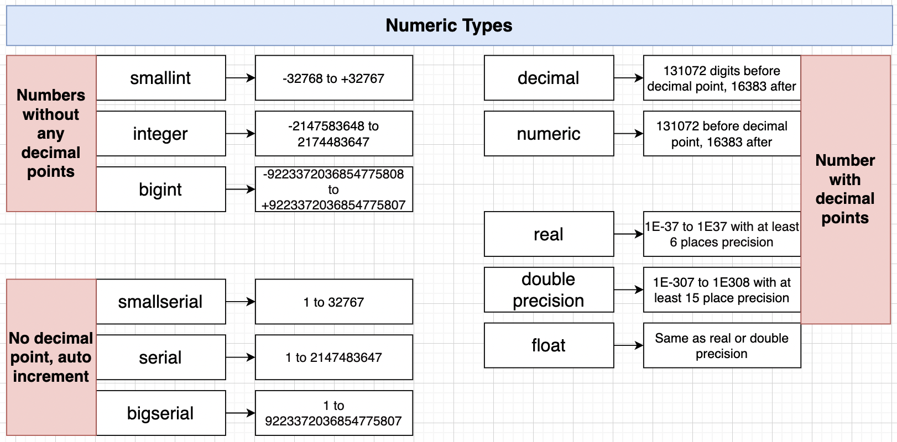
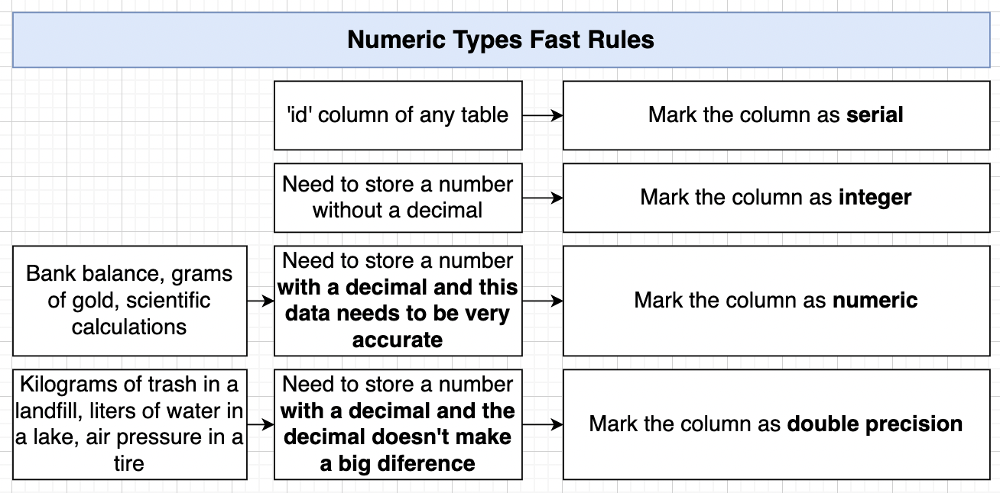
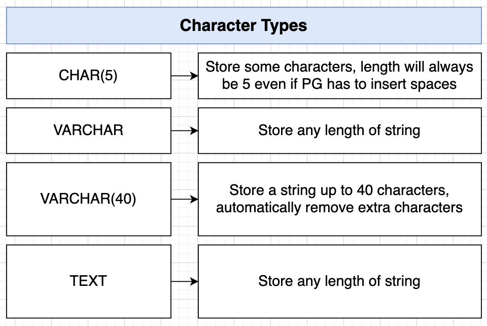
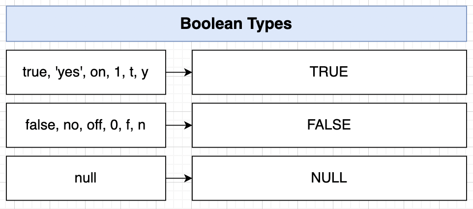
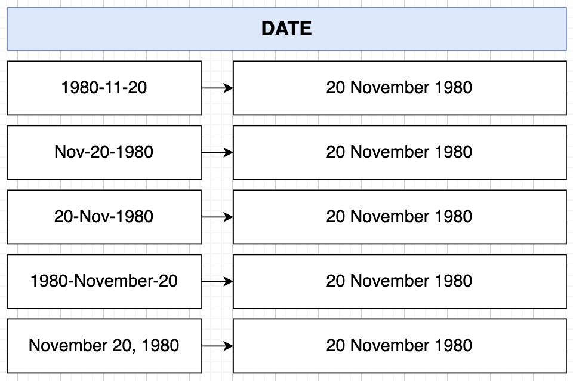
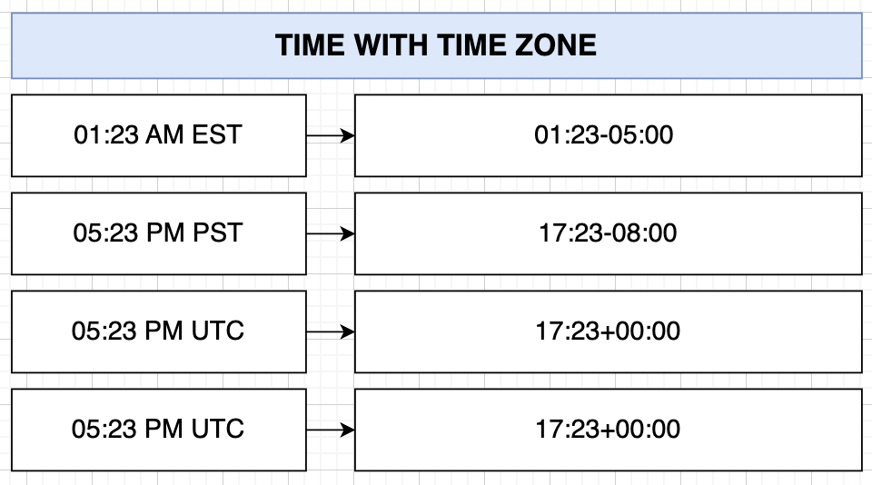
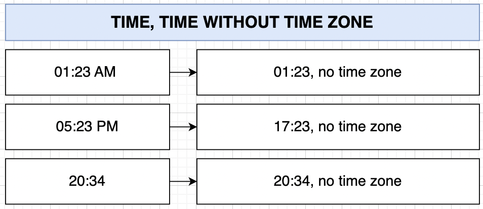
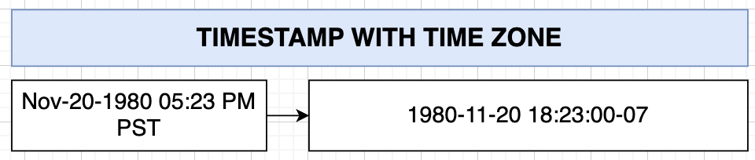
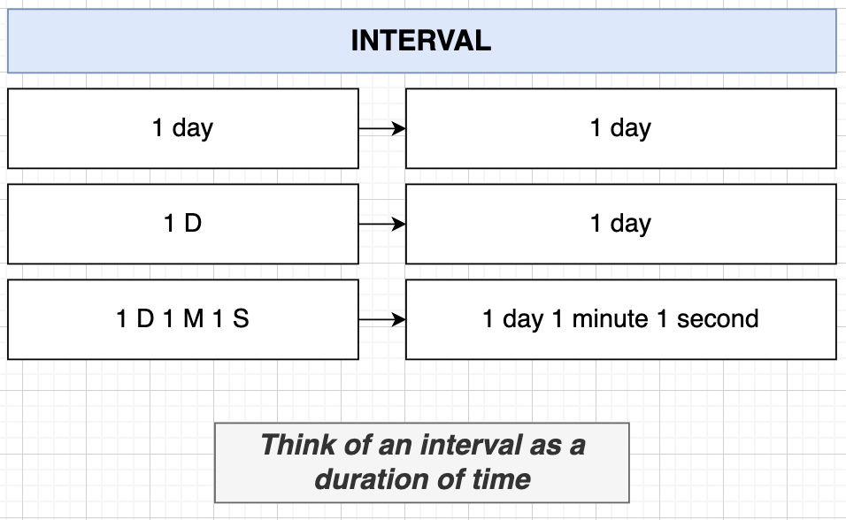

# PostgreSQL Complex Data Types

## Data Type Categories



## Numeric Types




```sql
SELECT (2.0::SMALLINT) -- telling postgres to treat 2.0 as SMALLINT

SELECT (99999::SMALLINT) -- ERROR:  smallint out of range

-- Precise
SELECT (1.99999::DECIMAL - 1.99998::DECIMAL) -- 0.00001
SELECT (1.99999::NUMERIC - 1.99998::NUMERIC) -- 0.00001

-- real, double precision, float are treated as floating point math
-- more efficient in performing math operations but not precise!
SELECT (1.99999::REAL - 1.99998::REAL) -- Output: 1.001358e-05 = 0.00001001358
```

## Character Types



- Unlike other databases, there is **no performance difference** for the different character data types.

```sql
SELECT ('JieWei'::CHAR(5)); -- Output: JieWe
SELECT ('Jie'::CHAR(5)); -- Output: Jie (adds 2 whitespaces behind)

SELECT ('Hello World'::VARCHAR(5)); -- Output: Hello
SELECT ('H'::VARCHAR(5)); -- Output: H (no whitespaces added behind)
```

## Boolean Types



```sql
-- true
SELECT ('true'::BOOLEAN);
SELECT ('t'::BOOLEAN);
SELECT ('yes'::BOOLEAN);
SELECT (1::BOOLEAN);

-- not true or false
SELECT (NULL::BOOLEAN);
```

## Times, Dates and Timestamps






- Very flexible when we input times, dates and timestamps in Postgres.

```sql
-- Dates
SELECT ('NOV-20-1980'::DATE); -- Output: "1980-11-20"
SELECT ('NOV 20 1980'::DATE);
SELECT ('1980 November 20'::DATE);

-- Time, Time without Time Zone
SELECT ('01:23'::TIME); -- Output: "01:23:00"
SELECT ('01:23 PM'::TIME); -- Output: "13:23:00"
SELECT ('01:23:23'::TIME); -- Output: "01:23:23"
SELECT ('01:23 PM'::TIME WITHOUT TIME ZONE); -- Output: "13:23:00"

-- Time with Time Zone
SELECT ('01:23 AM EST'::TIME WITH TIME ZONE); -- Output: "01:23:00-05:00"
SELECT ('01:23:23 AM PST'::TIME WITH TIME ZONE); -- Output: "01:23:23-08:00"
SELECT ('01:23:23 AM UTC'::TIME WITH TIME ZONE); -- Output: "01:23:23+00:00"

-- Timestamp with Time Zone
SELECT ('Nov-20-1980 05:23 PM PST'::TIMESTAMP WITH TIME ZONE); -- Output: "1980-11-21 08:53:00+07:30"
```

## Interval



- Duration of time.

```sql
SELECT ('1 D'::INTERVAL); -- Output: "1 day"
SELECT ('1 D'::INTERVAL); -- Output: "1 day"
SELECT ('1 D 20 H'::INTERVAL); -- Output: "1 day 20:00:00"
SELECT ('1 D 20 H 30 M 45 S'::INTERVAL); -- Output: "1 day 20:30:45"

-- Math operation on INTERVAL
SELECT ('1 D 20 H 30 M 45 S'::INTERVAL) - ('1D'::INTERVAL) -- Output: "20:30:45"

SELECT 
	('NOV-20-1980 1:23 AM EST'::TIMESTAMP WITH TIME ZONE)
	-
	('1 D'::INTERVAL); -- Output: "1980-11-19 13:53:00+07:30"

SELECT 
	('NOV-20-1980 1:23 AM EST'::TIMESTAMP WITH TIME ZONE)
	-
	('NOV-10-1980 1:23 AM EST'::TIMESTAMP WITH TIME ZONE) -- Output: "10 days"

SELECT 
	('NOV-20-1980 1:23 AM EST'::TIMESTAMP WITH TIME ZONE)
	-
	('NOV-10-1980 5:43 AM PST'::TIMESTAMP WITH TIME ZONE) -- Output: "9 days 16:40:00"
```