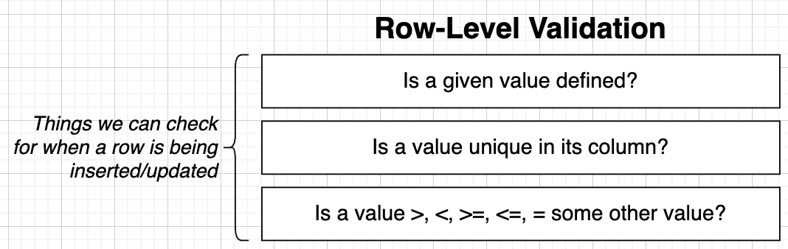
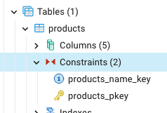

# Database-Side Validation and Constraints

## Validation

- Usually, our Web Server will do the validation before writing data in our database.

## Creating and Viewing Tables in pgadmin

```sql
CREATE TABLE products (
	id SERIAL PRIMARY KEY,
	name VARCHAR(40),
	department VARCHAR(40),
	price INTEGER,
	weight INTEGER
);

INSERT INTO products (name, department, price, weight)
VALUES
	('Shirt', 'Clothes', 20, 1);

INSERT INTO products (name, department, weight)
VALUES
	('Pants', 'Clothes', 3); -- price was inserted as NULL (this is an issue! we need some validation for price)
```

## Row-Level Validation



## Applying a NULL constraint to Table Column

```sql
-- When creating the table
CREATE TABLE products (
	id SERIAL PRIMARY KEY,
	name VARCHAR(40) NOT NULL,
	department VARCHAR(40) NOT NULL,
	price INTEGER NOT NULL,
	weight INTEGER
);

ALTER TABLE products
ALTER COLUMN price
SET NOT NULL;

-- Trying to INSERT NULL values
INSERT INTO products (name, department, weight)
VALUES ('Shoes', 'Clothes', 5); -- ERROR:  null value in column "price" of relation "products" violates not-null constraint
```

## Default Column Values

- If price is not defined, we use a default value.

```sql
-- When creating the table
CREATE TABLE products (
    ...
	price INTEGER DEFAULT 999
	...
);

-- After table was created
ALTER TABLE products
ALTER COLUMN price
SET DEFAULT 999;
```

## `UNIQUE` constraint

- A `UNIQUE` constraint ensures that the values in a specified column or group of columns are unique across all rows in a table.

```sql
-- Cannot have 2 product with the same name
-- When creating the table
CREATE TABLE products (
	id SERIAL PRIMARY KEY,
	name VARCHAR(40) NOT NULL UNIQUE,
	department VARCHAR(40),
	price INTEGER,
	weight INTEGER
);

-- After the table was created
ALTER TABLE products
ADD UNIQUE (name);
```

## `DROP CONSTRAINT`



```sql
ALTER TABLE products
DROP CONSTRAINT products_name_key;
```

## Multiple-Column Uniqueness

```sql
-- When creating the table
CREATE TABLE products (
	id SERIAL PRIMARY KEY,
	name VARCHAR(40),
	department VARCHAR(40),
	price INTEGER,
	weight INTEGER,
	UNIQUE(name, department)
);

-- After the table was created
ALTER TABLE products
ADD UNIQUE(name, department);
```

## Adding a Validation `CHECK`

- `CHECK` can only work on the row we are adding/updating.
- Can perform basic operators (>, <, >=, <=, =)

```sql
-- price of product must be greater than 0
-- When creating the table
CREATE TABLE products (
	id SERIAL PRIMARY KEY,
	name VARCHAR(40),
	department VARCHAR(40),
	price INTEGER CHECK (price) > 0, -- CHECK
	weight INTEGER,
	UNIQUE(name, department)
);

-- After the table was created
ALTER TABLE products
ADD CHECK (price > 0);
```

## `CHECK` over multiple columns

```sql
-- Probably should make sure than an order is delivered after it is created
CREATE TABLE orders (
	id SERIAL PRIMARY KEY,
	name VARCHAR(40) NOT NULL,
	created_at TIMESTAMP NOT NULL,
	est_delivery TIMESTAMP NOT NULL,
	CHECK(created_at < est_delivery)
);

-- ERROR:  new row for relation "orders" violates check constraint "orders_check"
-- DETAIL:  Failing row contains (3, Shirt, 2000-11-10 01:00:00, 2000-11-08 01:00:00).
INSERT INTO orders (name, created_at, est_delivery)
VALUES('Shirt', '2000-NOV-10 01:00AM', '2000-NOV-08 01:00AM');
```