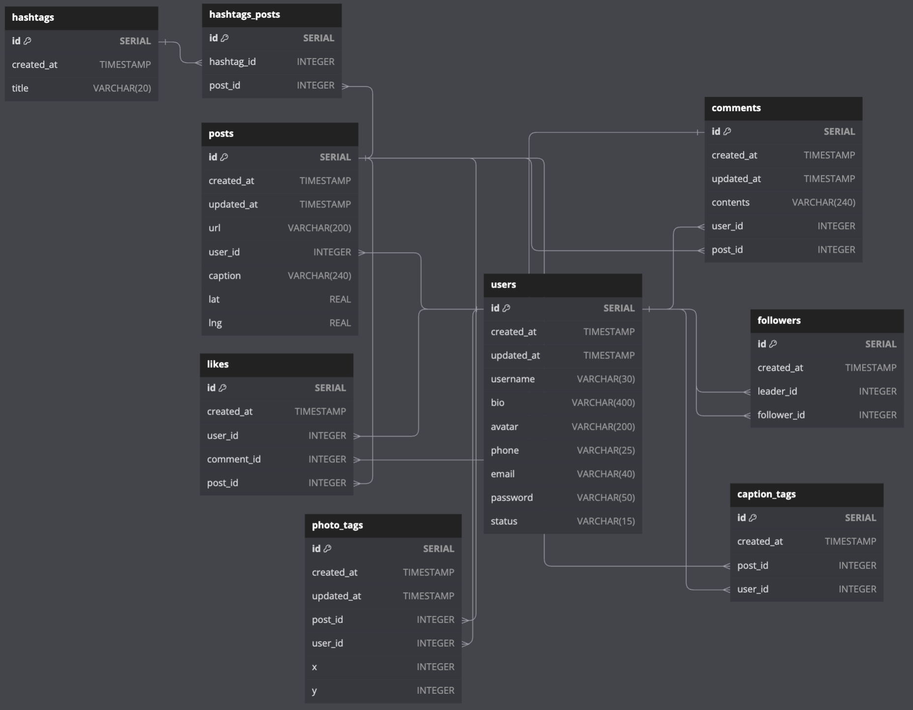

# Instagram DB Design

## 'LIKE' System

- Rules of Instagram 'LIKE' system

1. Each user can like a specific post a single time.
2. A user should be able to 'unlike' a post
3. Need to be able to figure out how many users like a post.
4. Need to be able to list which users like a post.
5. Something besides a post might need to be liked (e.g., comments).
6. We might want to think about 'dislikes' or other kinds of reactions.

---

#### Database Design

- Create a `likes` table.
  - Columns: `id`, `user_id`, `post_id`
- Add a unique constraint with `UNIQUE(user_id, post_id)`

---

#### Polymorphic Associations


- [Downside] Unable to use `liked_id` as a foreign key to `posts` or `comments`. This results in **data inconsistency** as we can insert a `liked_id` that does not exist in `posts` or `comments` like 99999.

---

#### Polymorphic Associations (Alternative Implementation)


- Cannot have `post_id` and `comment_id` both to be NULL at the same time OR both to have an integer at the same time. Have to add in a `CHECK` constraint.
- [Downside] Have to write down a complex `CHECK` constraint.
- We will be using this approach because we assume a user can only 'like' a post or comment, no such thing as different reaction types ('love','clap','shock').

---

#### Simplest Alternative Solution


- Create 2 mapping tables for posts and comments to associate with users.
- [Downside] Have to create many different tables.

---

## 'Mention' System

- In this example, we are going with solution 2.
- Go for solution 1 if you are not planning to add any special association to tags in photos and captions.


## 'Hashtag' System

- In instagram, when we search for hashtags, the posts with those hashtags are returned.
- This implies that hashtags in a post's caption are modeled in the DB!
- There is no need to model hashtags in `comments` and `users`.

## 'Follower System'

- Can be calculated by running a query on data that already exists in the DB.
- This is called `derived data`. we generally don't want to store derived data.
    - E.g., Finding out the number of posts or the number of followers/following.

# Final Database Diagram (Entity Relationship Diagram)



## `dbdiagram.io` ERD Code

- Navigate to `dbdiagram.io` and paste the following code on the left side to generate the ERD Diagram.

```sql
Table users {
  id SERIAL [pk, increment]
  created_at TIMESTAMP
  updated_at TIMESTAMP
  username VARCHAR(30)
  bio VARCHAR(400)
  avatar VARCHAR(200)
  phone VARCHAR(25)
  email VARCHAR(40)
  password VARCHAR(50)
  status VARCHAR(15)
}

Table posts {
  id SERIAL [pk, increment]
  created_at TIMESTAMP
  updated_at TIMESTAMP
  url VARCHAR(200)
  user_id INTEGER [ref: > users.id]
  caption VARCHAR(240)
  lat REAL
  lng REAL
}

Table comments {
  id SERIAL [pk, increment]
  created_at TIMESTAMP
  updated_at TIMESTAMP
  contents VARCHAR(240)
  user_id INTEGER [ref: > users.id]
  post_id INTEGER [ref: > posts.id]
}

Table likes {
  id SERIAL [pk, increment]
  created_at TIMESTAMP
  user_id INTEGER [ref: > users.id]
  comment_id INTEGER [ref: > comments.id]
  post_id INTEGER [ref: > posts.id]
}

Table photo_tags {
  id SERIAL [pk, increment]
  created_at TIMESTAMP
  updated_at TIMESTAMP
  post_id INTEGER [ref: > posts.id]
  user_id INTEGER [ref: > users.id]
  x INTEGER
  y INTEGER
}

Table caption_tags {
  id SERIAL [pk, increment]
  created_at TIMESTAMP
  post_id INTEGER [ref: > posts.id]
  user_id INTEGER [ref: > users.id]
}

Table hashtags {
  id SERIAL [pk, increment]
  created_at TIMESTAMP
  title VARCHAR(20)
}

Table hashtags_posts {
  id SERIAL [pk, increment]
  hashtag_id INTEGER [ref: > hashtags.id]
  post_id INTEGER [ref: > posts.id]
}

Table followers {
  id SERIAL [pk, increment]
  created_at TIMESTAMP
  leader_id INTEGER [ref: > users.id]
  follower_id INTEGER [ref: > users.id]
}
```
