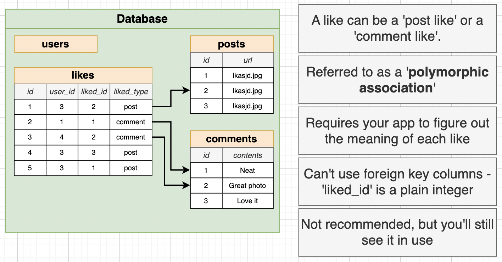

# Instagram DB Design

## 'LIKE' System

- Rules of Instagram 'LIKE' system

1. Each user can like a specific post a single time.
2. A user should be able to 'unlike' a post
3. Need to be able to figure out how many users like a post.
4. Need to be able to list which users like a post.
5. Something besides a post might need to be liked (e.g., comments).
6. We might want to think about 'dislikes' or other kinds of reactions.

---

#### Database Design

- Create a `likes` table.
  - Columns: `id`, `user_id`, `post_id`
- Add a unique constraint with `UNIQUE(user_id, post_id)`

---

#### Polymorphic Associations

- [Downside] Unable to use `liked_id` as a foreign key to `posts` or `comments`. This results in **data inconsistency** as we can insert a `liked_id` that does not exist in `posts` or `comments` like 99999.

---

#### Polymorphic Associations (Alternative Implementation)

- Cannot have `post_id` and `comment_id` both to be NULL at the same time OR both to have an integer at the same time. Have to add in a `CHECK` constraint.
- [Downside] Have to write down a complex `CHECK` constraint.
- We will be using this approach because we assume a user can only 'like' a post or comment, no such thing as different reaction types ('love','clap','shock').

---

#### Simplest Alternative Solution

- Create 2 mapping tables for posts and comments to associate with users.
- [Downside] Have to create many different tables.

---

## 'Mention' System

