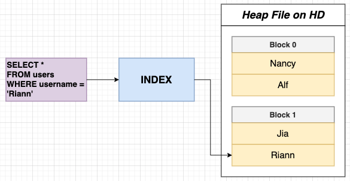

# A look at Indexes for Performance

- When we perform a `SELECT` query, we are loading up data from the Heap File on Hard Drive (HD) with all the blocks to the Memory(RAM), this could be costly in terms of performance. PostgreSQL needs to retrieve the required data from the storage (usually the heap file) and load it into memory (RAM) for processing.

## Full Table Scan

- Occurs when PostgreSQL reads all rows from a table, either because there's no suitable index to use for optimization or because the query's nature demands it.
- Frequently (but not always) poor performance.
- Full Table Scan can be resource-intensive and result in slower query performance, especially for large tables, as every row needs to be read from the hard drive (disk) and loaded into memory (RAM).

## What is an Index?



- Index is a data structure that efficiently tells us what block/index a record is stored at.
- Provides a way to quickly look up rows based on the values in *specific columns*.

## How an Index Works

1. Decide which column do we want to have very fast lookups on, i.e., `username`.
2. Extract only the property we want to do fast lookups by and the block & index for each.
    - Nancy: Block 0 Index 1
    - Alf: Block 0 Index 2
    - Jia: Block 1 Index 1
    - Riann: Block 1 Index 2
3. Sort in some meaningful way - Alphabetical for text, value for numbers, etc.
    - Alf, Jia, Nancy, Riann
4. Organize into a **B-tree (balanced tree) data structure**. Evenly distribute values in the leaf node, in order left to right.
    - [Left tree] Root Node: Go this way if 'Alf' <= username < 'Nancy'
        - Leaf Node: Alf (Block 0 Index 2), Jia (Block 1 Index 1)
    - [Right tree] Root Node: Go this way if 'Nancy' <= username
        - Leaf Node: Nancy (Block 0 Index 1), Riann (Block 1 Index 2)
    Example: If looking for username = 'Riann', then we will visit the right subtree.
5. Extract the block and index number of 'Riann' in the leaf node and use that information to look at 'Riann' record in the Heap File.

## Creating an Index

```sql
-- Schemas --> Tables --> users --> Indexes
CREATE INDEX ON users(username);

-- Manually name the index
CREATE INDEX users_username_idx ON users(username);

-- Deleting an Index
DROP INDEX users_username_idx;
```

## Benchmarking Queries (`EXPLAIN ANALYZE`)

```sql
-- With Index: 0.04 ms
-- Without Index: 1.20 ms
-- 1.20 ms / 0.04 ms = 30 times slower without indexes!
EXPLAIN ANALYZE 
SELECT * 
FROM users 
WHERE username = 'Emil30';
```