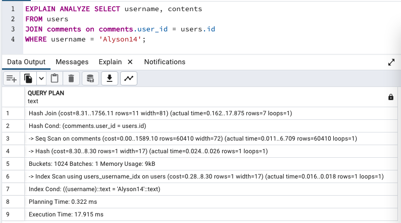

# Basic Query Tuning

## Query Processing Pipeline

1. Parser: Ensure SQL query is a valid statement.
2. Rewrite: Decompose views into underlying table references.
3. Planner: Evaluates which plan is the fastest.
   - Look at users_username_idx then get users?
   - Fetch all users and search through them?
4. Execute: Runs the query and retrieves the records.

## `EXPLAIN` and `EXPLAIN ANALYZE`

- `EXPLAIN`: build a query plan and display info about it.
- `EXPLAIN ANALYZE`: build a query plan, run it and info about it.
- These are for benchmarking + evaluating queries, not for use in real data fetching. Just for performance evaluation.



- "Hash Join (cost=8.31..1756.11 rows=11 width=81)"
  - `Hash Join`: How this node is generating data.
  - `cost=...`: Amount of processing power required for this step.
  - `rows=...`: A _guess_ at how many rows this step will produce.
  - `width=...`: A _guess_ at the average number of bytes of each row.

```sql
-- How PostgreSQL estimated rows and width
SELECT *
FROM pg_stats
WHERE tablename = 'users';
```

# Advanced Query Tuning

## Developing an Intuitive Understanding of Cost

- `cost`: Amount of time (seconds, milliseconds) to execute some part of our query plan.

---

#### Retrieve users with index `users_username_idx`:

1. Find the ID's of users who have username of 'Alyson14'
   - Get root node
   - Jump to some random child page
   - Process the values in that node
2. Open users heapfile
3. Jump to each block that has the users we are looking for and process the appropriate users from each block.

- Note: Steps 1 and 3 is around fetching 1 random page each (total 2 pages).

#### Fetch all users and search through them

1. Open users heapfile
2. Load all users from the first block
3. Process each user, see if it contains the correct username.
4. Repeat the process for the next block.

- Note: Steps 3 and 4 are done once for every page.

---

### Example Analysis

- Loading data from random spots off a hard drive usually takes **more time** than loading data sequentially (one piece after another).
- Let's _assume_ that loading a _random_ page takes **4 times longer** than loading up pages sequentially.

```
For `users_username_idx` index, (2 pages loaded in random order) * 4 = 8
For fetching sequentially, (110 pages loaded sequentially) * 1 = 110

Thus, fetching sequentially seems to be the slower operation.
```

---

## Calculating Cost By Hand

--

#### Example: Fetch all comments

1. Open the comments heap file
2. Load all comments from the first block
3. Process each comment in some way
4. Repeat the process for the next block

```
-> Seq Scan on comments (cost=0.00..1589.10 rows=60410 width=72)

- In comments table, there are 60410 rows and 985 pages.
- Processing a single row is really cheap compared to loading an entire page

- Processing 1 row costs 1% of processing 1 page
(# pages) * 1.0 + (# rows) * 0.01
(985) * 1.0 + (60410) * 0.01 = 1589.10 (we guessed the cost of loading a row and page sequentially)
```

--

## More on Costs

- [Query Planning Costs](https://www.postgresql.org/docs/current/runtime-config-query.html)
- `seq_page_cost` is the baseline value for query cost.

```
// From Query Planning Costs PostgreSQL Documentation
seq_page_cost = 1.0
random_page_cost = 4.0
cpu_tuple_cost = 0.01
cpu_index_tuple_cost = 0.005
cpu_operator_cost = 0.0025

Cost =
        (# pages read sequentially) * seq_page_cost
        + (# pages read at random) * random_page_cost
        + (# rows scanned) * cpu_tuple_cost
        + (# index entries scanned) * cpu_index_tuple_cost
        + (# times function/operator evaluated) * cpu_operator_cost

// For sequential operations in PostgreSQL
Cost =
        (# pages read sequentially) * seq_page_cost
        + (# rows scanned) * cpu_tuple_cost
```

## Startup vs Total Costs

- E.g., Hash Join (`cost=8.31..1756.11` ...)
  - `1st number`: Cost for this step to produce the first row.
  - `2nd number`: Cost for this step to produce all rows.
- If both numbers are the same (e.g., Hash (cost=8.30..8.30), this means that all rows emitted from this step must be completed before these rows can be passed on to the next step.)

## PostgreSQL running Sequential Scan instead of Index

- If PostgreSQL is running sequential scan instead of indexing, don't force it to run index because PG has probably done the math and realize that sequential scan is faster.

1. Creating Index for `created_at` column in `likes` table.

```sql
CREATE INDEX likes_created_at_idx ON likes (created_at);
```

2. Checking count for `created_at < '2013-01-01'` and `created_at > '2013-01-01'`

```sql
SELECT COUNT(*) FROM likes
WHERE created_at < '2013-01-01'; -- Output: 63000

SELECT COUNT(*) FROM likes
WHERE created_at > '2013-01-01'; -- Output: 689009
```

3. Using `EXPLAIN` on the SQL Queries in step 2

```sql
EXPLAIN SELECT COUNT(*) FROM likes
WHERE created_at < '2013-01-01'; -- Output: PostgreSQL used index

EXPLAIN SELECT COUNT(*) FROM likes
WHERE created_at > '2013-01-01'; -- Output; PostgreSQL used Sequential Scan
```

- In the first SQL Query where `created_at < '2013-01-01'`, the number of queries is much less than the second SQL Query where `created_at > '2013-01-01'`.
- If PostgreSQL were to use indexing in the second query, the operation has to visit all the leaf nodes and get the block/index of the records and then search the heap file for these records.
- Searching through a large number of leaf nodes is costly as opposed to just using sequential scan to retrieve a large number of records.
- Thus, PostgreSQL did internal calculation and realized that the sequential scan was more beneficial for the second SQL Query.
