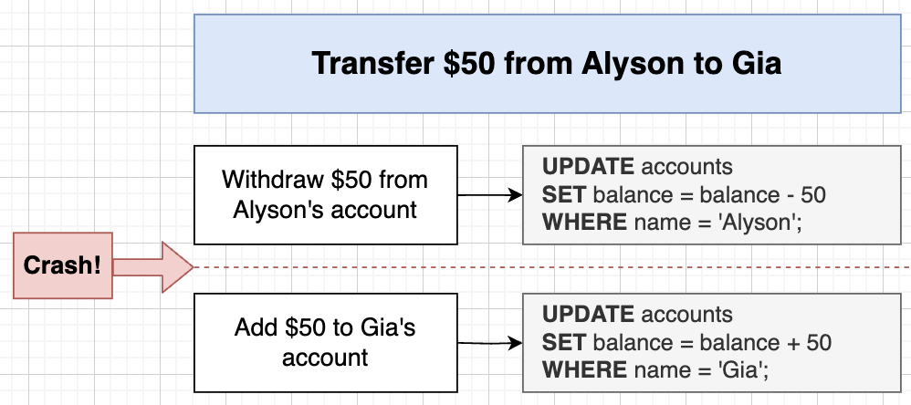
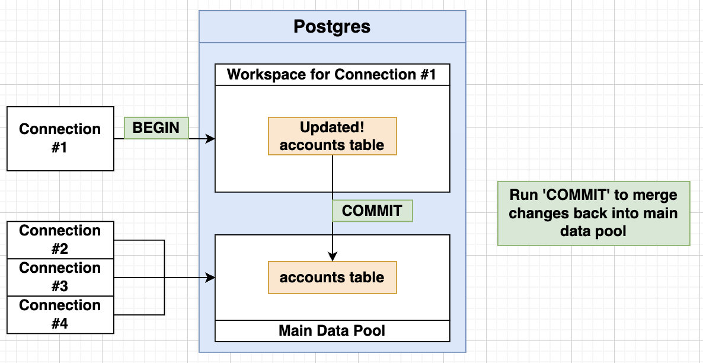
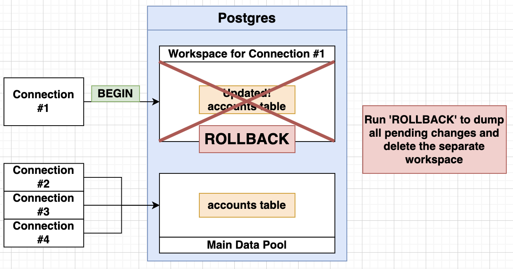
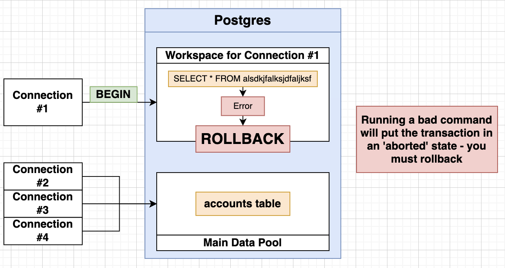
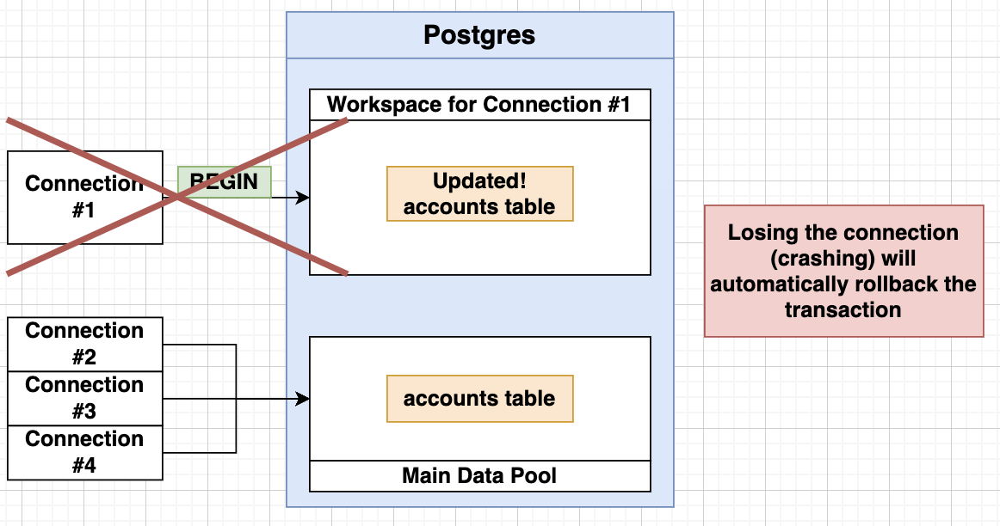

# Transactions



- SQL Transactions provide a way to ensure the integrity and consistency of data within a database, especially when multiple operations are performed concurrently.
- Transactions are typically defined by a series of SQL statements that are executed as a single, indivisible unit of work.

## Process of SQL Transaction

- `BEGIN`: To start a transaction. This marks the beginning of a transaction block.
- `COMMIT`: If all the operations in the transaction are successful and you want to make the changes permanent, you issue a `COMMIT` statement. This saves the changes to the database and ends the transaction.
- `ROLLBACK`: If an error occurs during the transaction or if you decide to cancel the changes, can issue a `ROLLBACK` statement. This undoes all the changes made within the transaction and ends it.

## Example of SQL Transaction



```sql
-- setup
CREATE TABLE accounts (
	id SERIAL PRIMARY KEY,
	name VARCHAR(20) NOT NULL,
	balance INTEGER NOT NULL
);

INSERT INTO accounts (name, balance)
VALUES
	('Gia', 100),
	('Alyson', 100);

SELECT * FROM accounts;
```

```sql
BEGIN;

UPDATE accounts
SET balance = balance + 50
WHERE name = 'Gia';

COMMIT;
```

## Transaction Cleanup on Crash





```sql
-- use ROLLBACK if there is an error
BEGIN

ROLLBACK;
```
