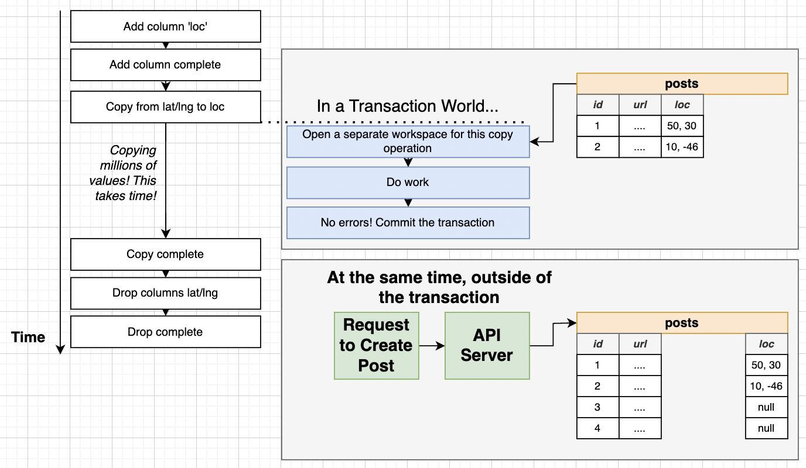

# Managing Database Design with Schema Migrations

- Making changes to your database structure.
- Important points:
  1. Changes to the DB structure and changes to the clients need to be made at precisely the same time.
  2. When working with other engineers, we need a really easy way to tie the structure of our database to our code.
- **Schema Migration File**: Code that describes a precise change to make to the database.

## Migration File

## Schema Migration and Data Migration

- Not recommended to run schema migration and data migration in 1 step. Could be a long operation and we might lose some data in the process.
- Migrations should be placed inside a SQL **transaction** so that we can rollback if anything happens.

## Different Approaches with Migration from API to PostgreSQL

