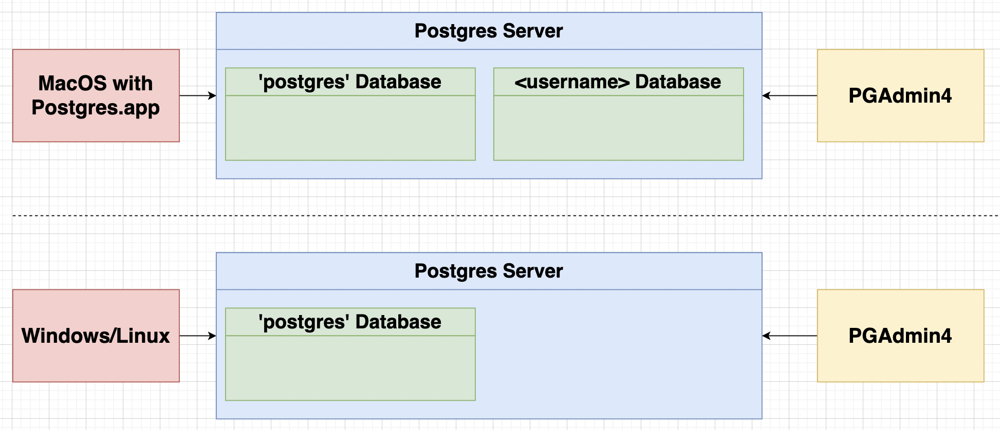
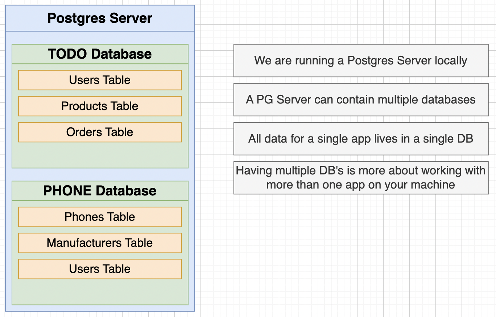

# PostgreSQL Installation on MacOS

- Run `psql` to check is postgreSQL has been installed. If output is `zsh: command not found: psql`, means not installed.

1. Postgres.app
   - App that will install + configure Postgres for you perfectly.
   - Makes it easy to start/stop the database to save resources.
   - [postgresapp](https://postgresapp.com)
     - Get stuck at any point? Follow uninstall directions at Documentation --> Uninstalling
2. Homebrew
   - Requires a bit more setup, but still really easy.

## pgadmin

1. [pgadmin](https://www.pgadmin.org/download/)

- Tool to manage and interact with Postgres database
- Can connect to local or remote databases
- Can view/change just about anything in PG

## Postgres Databases

