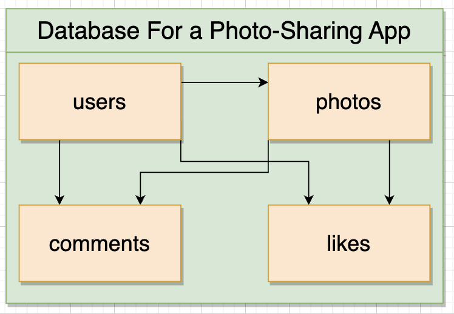

# Working with Multiple Tables

## Database Design of Instagram

- Profile for a user
- Users have followers and can follow other users
- List of photos
- Users can like a photo
- List of comments, each created by a user

## One-to-Many and Many-to-One Relationship

- One-to-Many
    - A user *has many* photos
    - A photo *has many* comments
- Many-to-One
    - A photo *has one* user
    - A comment *has one* photo

## One-to-One and Many-to-Many Relationship

- One-to-One
    - A boat has one captain, and vice versa.
    - A company has one CEO, and vice versa.
- Many-to-Many
    - A student has many classes, and vice versa.
    - A player has many basketball matches, and vice versa.

