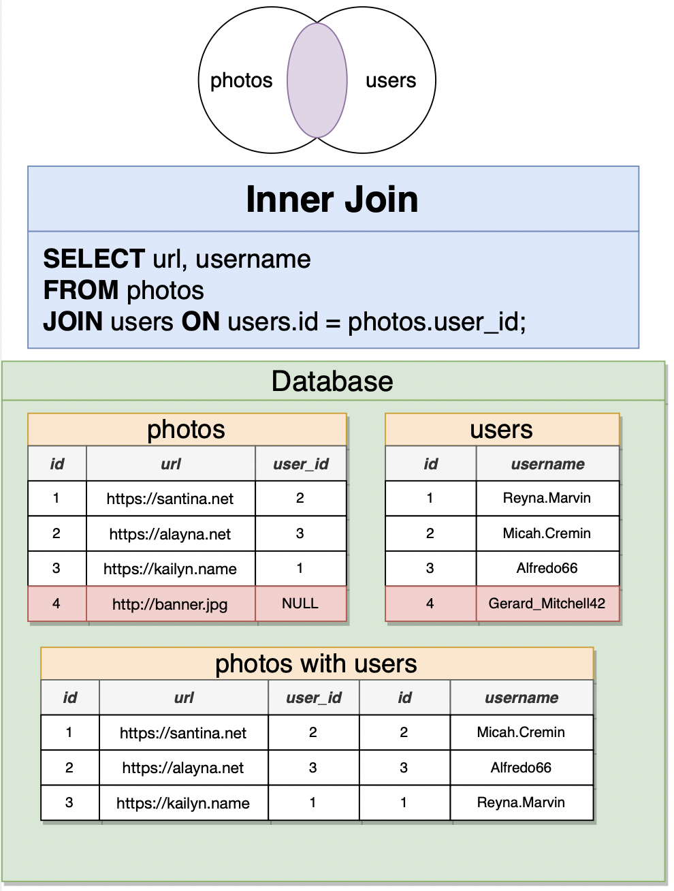
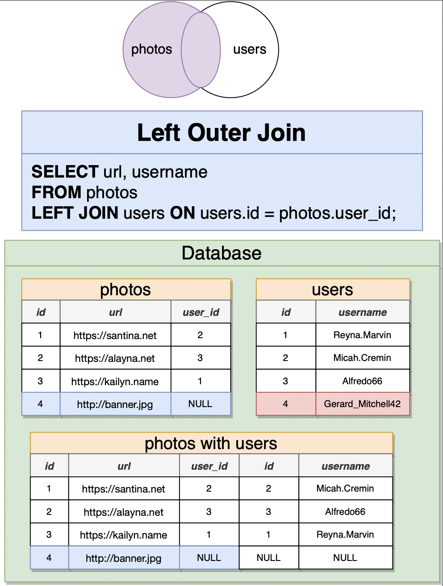
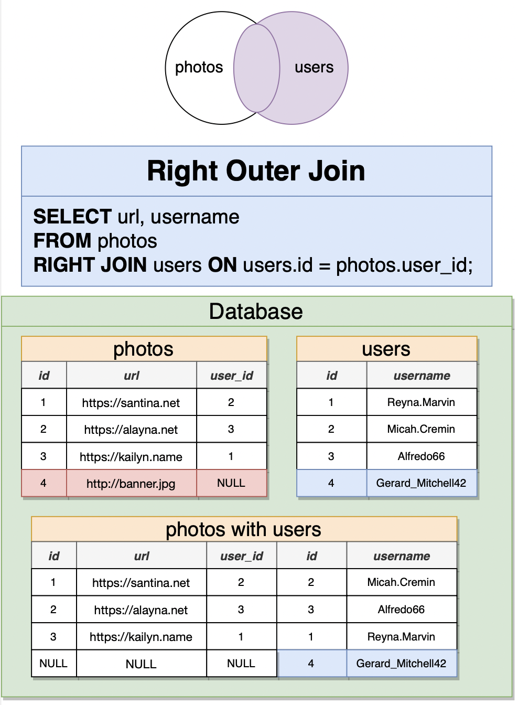
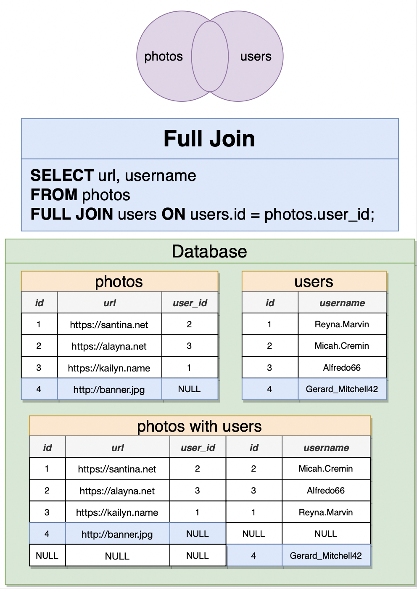

# Relating Records with Joins

## Join with Different Tables


```sql
SELECT contents, username
FROM COMMENTS
JOIN users ON users.id = comments.user_id;

-- Shorter Syntax
SELECT comments.id AS comment_id, p.id
FROM photos AS p
JOIN COMMENTS ON comments.photo_id = p.id;
```

## 4 types of Joins

- `INNER JOIN` or `JOIN`, removes rows that don't match in both tables
- `LEFT JOIN`
- `RIGHT JOIN`
- `FULL JOIN`






## Order of Join Matters!

