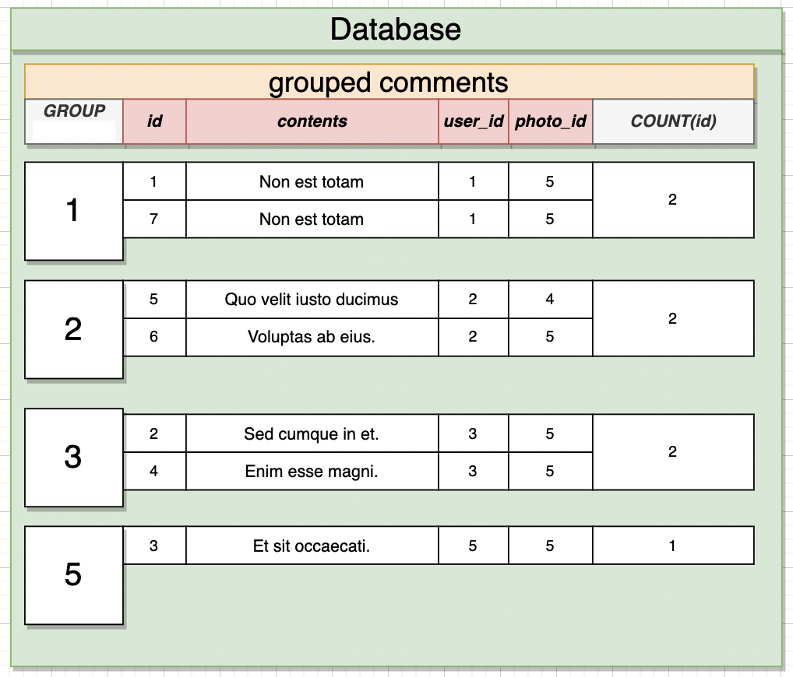

# Aggregating and Grouping

- `Grouping`:
  - Reduces many rows down to fewer rows.
  - Done by using the `GROUP BY` keyword.
  - Visualizing the result is key to use.
- `Aggregates`:
  - Reduces many values down to 1.
  - Done by using 'aggregate functions'.

## Group By

- `GROUP BY user_id`:
  - Find the set of all unique user_id's
  - Take each row and assign it to group based on its user_id
- Can only `SELECT` the `user_id`, not other rows because they are not included in the `GROUP BY`

```sql
SELECT user_id FROM comments
GROUP BY user_id;
```


## Aggregate Functions

| Aggregate Functions | Description                                                               |
| :-----------------: | ------------------------------------------------------------------------- |
|      `COUNT()`      | Returns the number of values in a group of values, excludes `NULL` values |
|       `SUM()`       | Finds the **sum** of a group of numbers.                                  |
|       `AVG()`       | Finds the **average** of a group of numbers.                              |
|       `MIN()`       | Returns the **minimum** value from a group of numbers.                    |
|       `MAX()`       | Returns the **maximum** value from a group of numbers.                    |

```sql
SELECT COUNT(id) FROM comments;
SELECT SUM(id) FROM comments;
SELECT AVG(id) FROM comments;
SELECT MIN(id) FROM comments;
SELECT MAX(id) FROM comments;

SELECT MAX(id), contents FROM comments; -- this results in an aggregate function error
```

## Combining `GROUP BY` and Aggregates



```sql
-- Counts the number of comments the user has made
SELECT user_id, COUNT(id) AS no_of_comments
FROM comments
GROUP BY user_id;
```

```sql
-- will count NULL values too instead of referencing a single column COUNT(user_id)
SELECT COUNT(*) FROM photos;
```

```sql
-- Find the number of comments for each photo
-- `comments` table: id, contents, user_id, photo_id
SELECT photo_id, COUNT(*)
FROM comments
GROUP BY photo_id;
```

## GROUP BY with JOIN

```sql
SELECT name, COUNT(*)
FROM books
JOIN authors ON authors.id = books.author_id
GROUP BY authors.name;
```