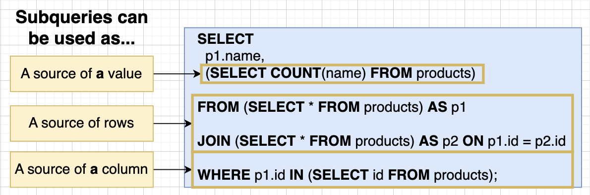
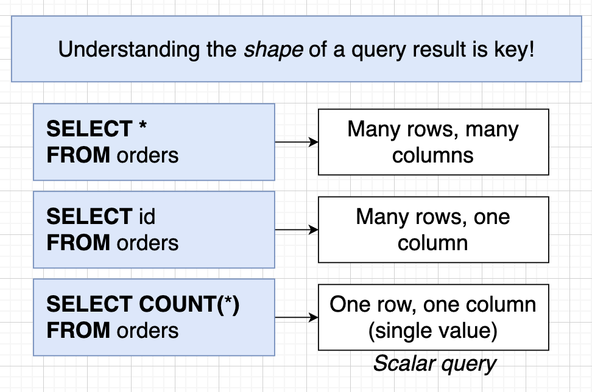

# Assembling Queries with SubQueries

## What's a SubQuery?

- A SubQuery in SQL is a nested query within another query that is used to retrieve data based on the results of the inner query.

```sql
-- List the name and price of all products that are
-- more expensive than all products in the Toys department
SELECT name, price
FROM products
WHERE price > (
    SELECT MAX(price) -- SubQuery
    FROM products
    WHERE department = 'Toys'
);
```




## SubQueries in a SELECT

- Can put the SubQuery in a SELECT because it returns a _single_ value.

```sql
-- Any SubQuery that results in a single value
SELECT name, price, (SELECT MAX(price) FROM products)
FROM products
WHERE price > 876
```

```sql
-- Write a query that prints the name and price for each phone.  In addition, print out the ratio of the phones price against max price of all phones (so price / max price).  Rename this third column to price_ratio
SELECT name, price,
(price / (SELECT MAX(price) FROM phones)) AS price_ratio
FROM phones;
```
