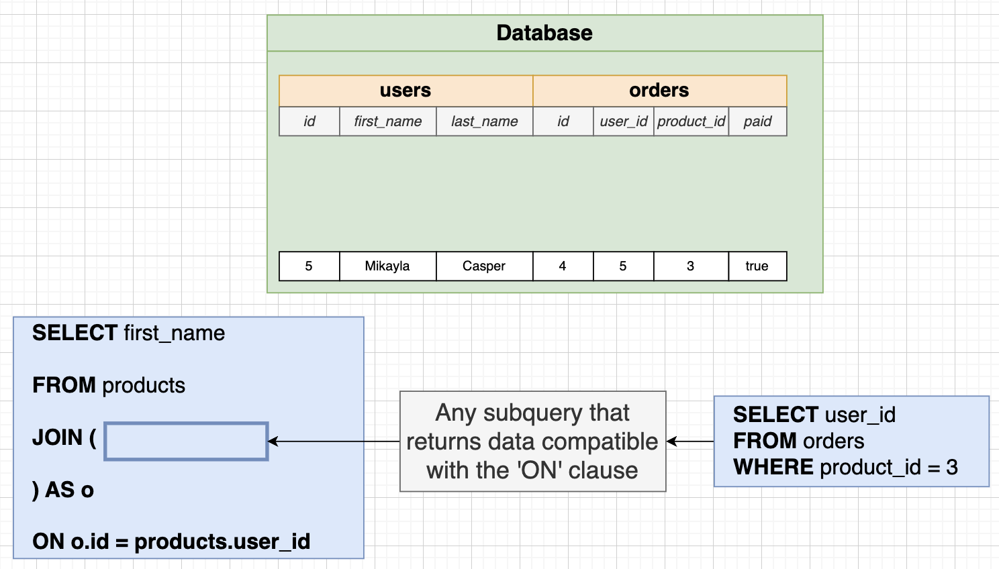

# Assembling Queries with SubQueries

## What's a SubQuery?

- A SubQuery in SQL is a nested query within another query that is used to retrieve data based on the results of the inner query.

```sql
-- List the name and price of all products that are
-- more expensive than all products in the Toys department
SELECT name, price
FROM products
WHERE price > (
    SELECT MAX(price) -- SubQuery
    FROM products
    WHERE department = 'Toys'
);
```


## SubQueries in a `SELECT`

- Can put the SubQuery in a SELECT because it returns a _single_ value.

```sql
-- Any SubQuery that results in a single value
SELECT name, price, (SELECT MAX(price) FROM products)
FROM products
WHERE price > 876
```

```sql
-- Write a query that prints the name and price for each phone.  In addition, print out the ratio of the phones price against max price of all phones (so price / max price).  Rename this third column to price_ratio
SELECT name, price,
(price / (SELECT MAX(price) FROM phones)) AS price_ratio
FROM phones;
```

## SubQueries in a `FROM`

- Any SubQuery so long as the outer SELECT/WHERE/etc are compatible
- The SubQuery must have an alias applied to it.

```sql
-- Meaningless Example (for learning)
SELECT name, price_weight_ratio
FROM (
    SELECT name, price / weight AS price_weight_ratio
    FROM products
) AS p -- must include this alias 'p' for the FROM SubQuery
WHERE price_weight_ratio > 5

-- Meaningful example (Find the average number of orders for all users)
SELECT AVG(order_count)
FROM (
    SELECT user_id, COUNT(*) AS order_count
	FROM orders
	GROUP BY user_id
) AS p;
```

```sql
-- Assignment
-- Calculate the average price of phones for each manufacturer.  Then print the highest average price. Rename this value to max_average_price
-- Column in `phones` table: name, manufacturer, price, units_sold
SELECT MAX(avg_price) AS max_average_price
FROM (
    SELECT AVG(price) as avg_price
    FROM phones
    GROUP BY manufacturer
);
```

## SubQueries in `JOIN` clause



- Any SubQuery that returns data compatible with the `ON` clause.

```sql
-- Not the best example but this is just to understand how it works
SELECT first_name
FROM users
JOIN (
 	SELECT user_id FROM orders WHERE product_id = 3 
) AS o
ON o.user_id = users.id;
```

## SubQueries in `WHERE` clause

- These SubQueries are embedded within the main query to filter and retrieve data based on specific conditions or criteria.

```sql
-- Show the id of orders that involve a product with
-- a price/weight ratio greater than 50
SELECT id
FROM orders
WHERE product_id IN (
    SELECT id FROM products
    WHERE price/weight > 50
);
```

```sql
-- Show the name of all products with a price greater
-- then the average product price
SELECT name
FROM products
WHERE price > (
    SELECT AVG(price)
    FROM products
);
```